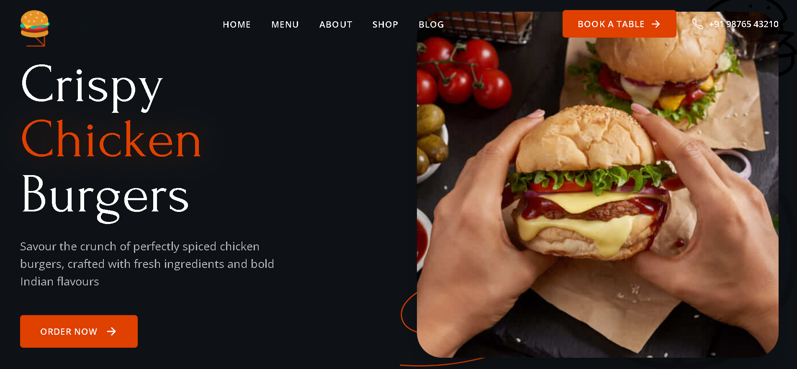
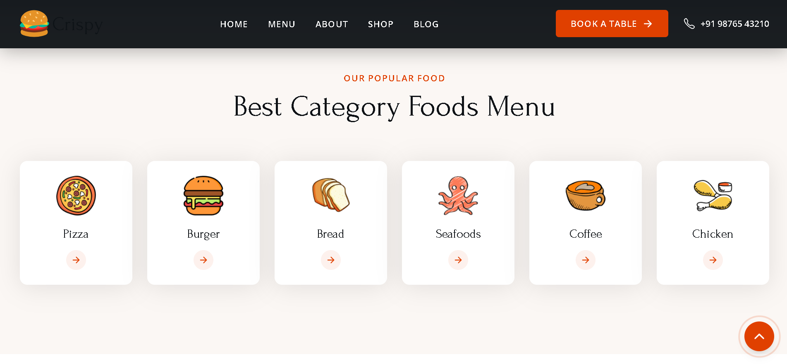
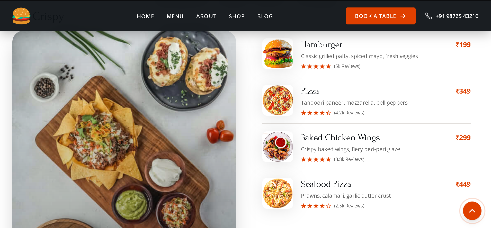
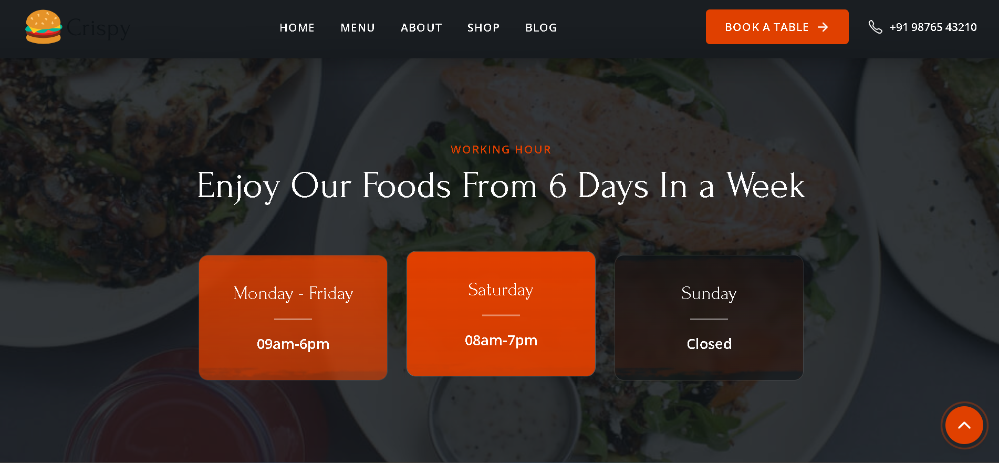
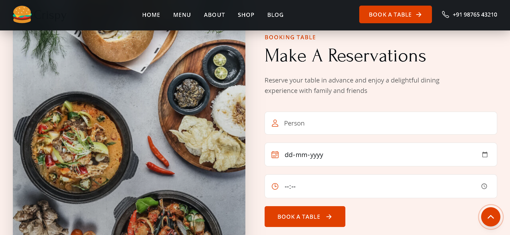
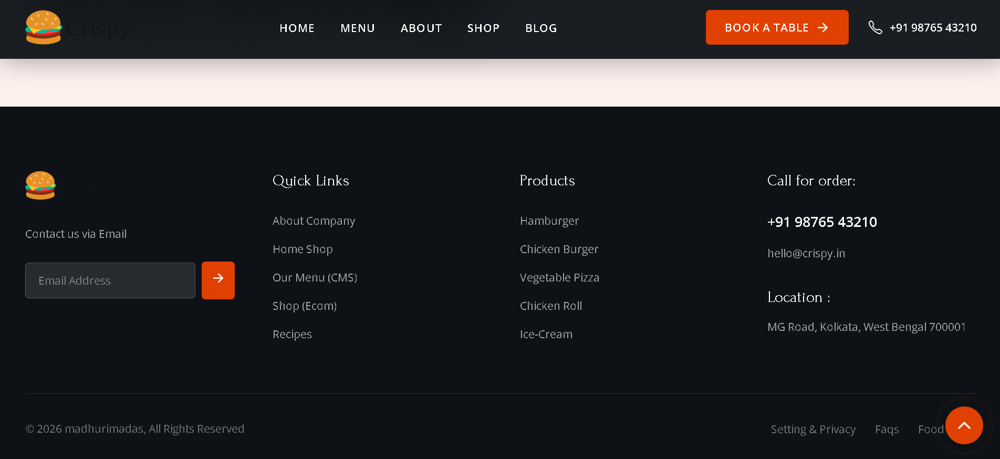

<h1 align="center">🍔 Food Ordering Website</h1>

A responsive food ordering web application built using HTML, CSS, and JavaScript.

<h2>📸 Screenshots</h2>

<h3>🏠 Home Section</h3>

  

<h3>🍽️ Food Categories</h3>

  

<h3>📋 Menu Section</h3>

  

<h3>⏰ Working Hours</h3>

  

<h3>📅 Table Booking</h3>

  

<h3>📞 Footer</h3>

  

<h2>🚀 Features</h2>
<ul>
  <li>🛒 Add to Cart functionality</li>
  <li>🍕 Interactive Food Menu</li>
  <li>📱 Responsive Design</li>
  <li>🧾 Order Summary</li>
  <li>🎨 Clean UI</li>
</ul>

<h2>🛠️ Tech Stack</h2>
<ul>
  <li><b>Frontend:</b> HTML, CSS, JavaScript</li>
  <li><b>Design:</b> Flexbox & Grid</li>
</ul>

<h2>⚙️ How to Run</h2>
<pre>
git clone https://github.com/mds06f/Food-ordering-website.git
</pre>

Open <code>index.html</code> in your browser.

<h2>👩‍💻 Author</h2>

<b>Madhurima Das</b>

<a href = https://github.com/mds06f>
[<b>Madhurima Das</b>](https://github.com/mds06f)

<h2>⭐ If You Like This Project</h2>

Don’t forget to star ⭐ the repository - it really helps!

